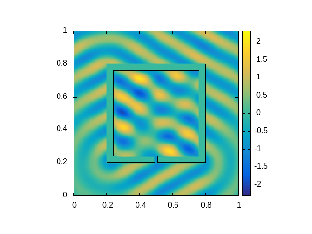

# Example plots

## Square scatterer

The scatterer is set to a unit square with $n_i=3$ and subdivided into 400 panels. The incoming wave is a plane wave $u_{inc}(x)=e^{i k d\cdot x}$ where $d = (\cos{\pi\over 3},\sin{\pi\over 3})$ and $k=40$ (left) resp. $k=41.955486$ (quasi-resonance, right).

  
  

## Hollow box scatterer with a hole

Hollow box scatterer with incoming plane wave from below, $n_i=10$, $k=120.76977$ (quasi-resonance), using 1200 panels:

  

A similar (non-penetrable) object having a much smaller hole and the scattered wave for a non-resonant resp. near-resonant $k$ are shown below. Here, $n_i=10^8$ and $k=42.5$ (left) resp. $k=42.688651$ (quasi-resonance, right). 384 panels and the same plane incoming wave as in the square scatterer case are used.

  
  

Note that the amplitude of the scattered wave inside the cavity is around 200 times larger than the amplitude of the incoming wave when $k$ is a quasi-resonance.

## Analytical solution on circle

The solution of the Helmholtz transmission problem on a circle with the incoming wave $u_{inc}(x)=J_{-2}(k r) e^{-2i\phi}+J_{-1}(k r) e^{-i\phi}+J_0(k r)+J_1(k r) e^{i\phi}+J_2(k r) e^{2i\phi}$, $x=(r\sin\phi,r\cos\phi)$ and $k=40$, coincides with the analytical solution (see [Diego Renner's thesis](https://github.com/DiegoRenner/ThesisDoc), section 2.3).

  

The same incoming wave scattered accros a torn/deformed circle:

  
  

## Incoming wave reflection

In the following examples, the incoming wave is a Herglotz wave function with $k=250$ and the inner refraction index $n_i$ is set to a very large value ($n_i=10^6$) so that the transmitted wave is practically zero.
The left image shows the sum of the scattered and incoming wave, and the right image shows only the scattered wave.

  
  

Another reflection example, in which the Herglotz wave is coming directly from below:

  

Plane wave hitting an oval object ($k=150$):

  

