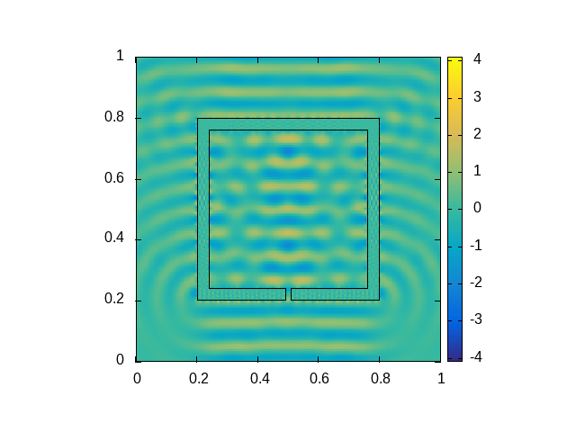
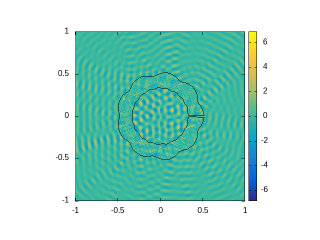
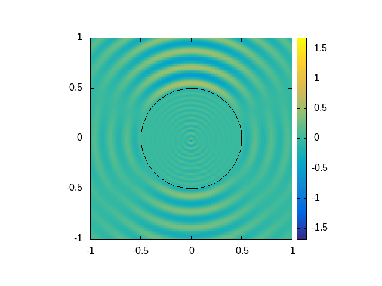
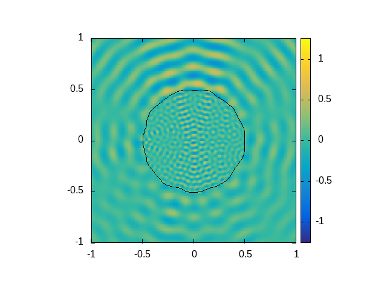
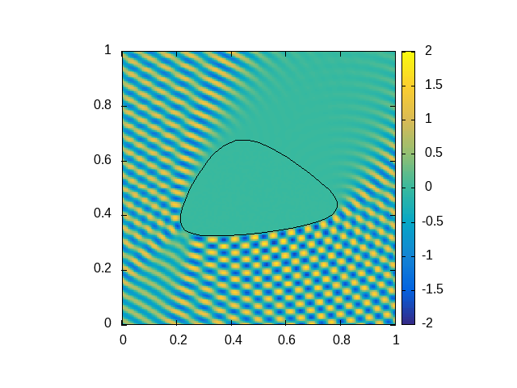

# Example solution plots

## Square scatterer

The scatterer is set to a unit square with $n_i=3$ and subdivided into 800 panels. The incoming wave is a plane wave $u_{inc}(x)=e^{i k d\cdot x}$ where $d = (\cos{\pi\over 3},\sin{\pi\over 3})$ and $k=40$ (left) resp. $k=41.955486$ (quasi-resonance, right).

  
  

## Hollow box scatterer with a hole

A hollow box with a small hole and the scattered wave for a non-resonant resp. near-resonant $k$ are shown below. Here, $n_i=100$ and $k=81.5$ (left) resp. $k=82.256558$ (quasi-resonance, right). 1000 panels and a plane wave incoming from below are used.

  
  

### Another cavity example

The scatterer is a wavy open torus with $n_i=100$, subdivided into 1200 panels. The plots below show the transmitted and scattered wave for the incoming plane wave from right and $k=84$ (left) resp. $k=83.00777$ (quasi-resonance, right).

  
  

## Analytical solution on circle

Left: the solution of the Helmholtz transmission problem on a circle ($n_i=10$) with the incoming wave $u_{inc}(x)=J_{-2}(k r) e^{-2i\phi}+J_{-1}(k r) e^{-i\phi}+J_0(k r)+J_1(k r) e^{i\phi}+J_2(k r) e^{2i\phi}$, $x=(r\sin\phi,r\cos\phi)$ and $k=40$, which coincides with the analytical solution (see [Diego Renner's thesis](https://github.com/DiegoRenner/ThesisDoc), section 2.3). Right: the same incoming wave scattered accross a deformed circle. 800 panels are used in both cases.

  
  

## Incoming wave reflection

In the examples below, the incoming wave is a Herglotz wave function with $k=250$ and the inner refraction index $n_i$ is set to a very large value ($n_i=10^8$) so that the transmitted wave is practically zero.
The left image shows the sum of the scattered and incoming wave, and the right image shows only the scattered wave. 1600 panels are used.

  
  

Left: Herglotz wave coming directly from below. Right: plane wave at 60 degrees ($k=150$) hitting an oval object (400 panels).

  
  

