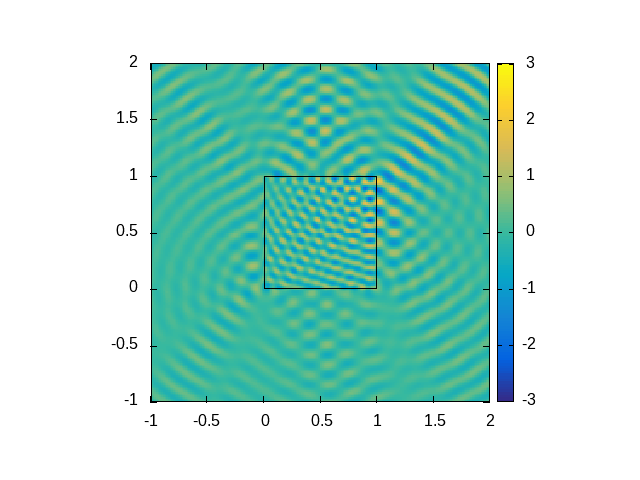
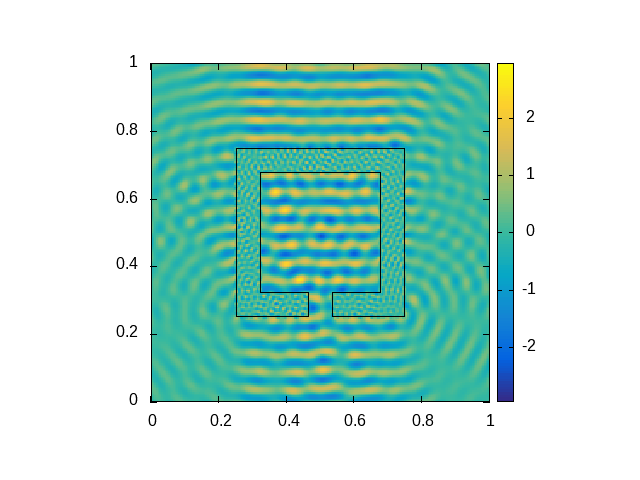
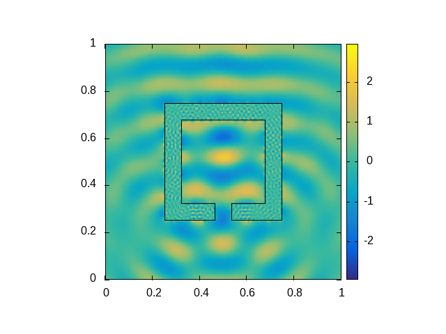
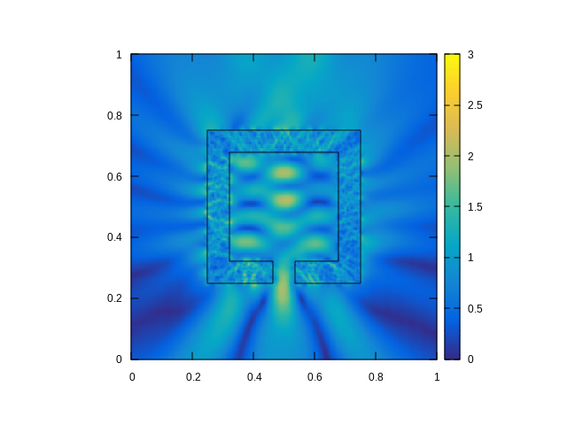
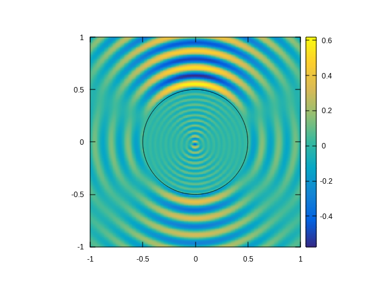
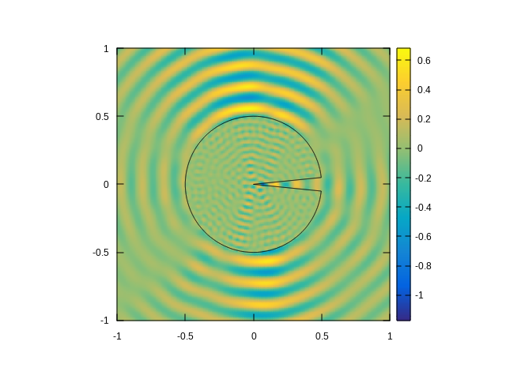
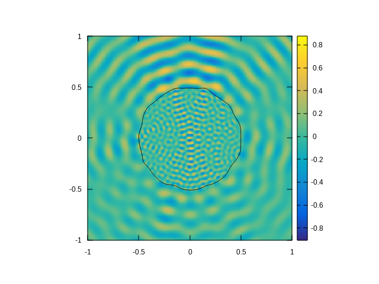
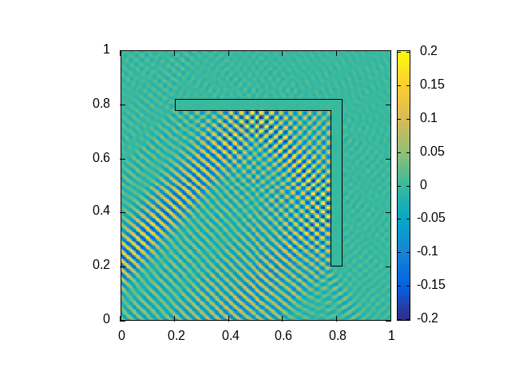
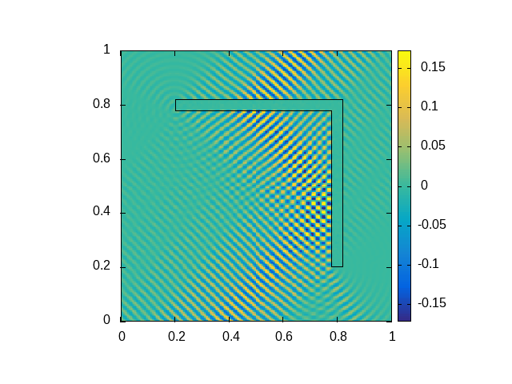
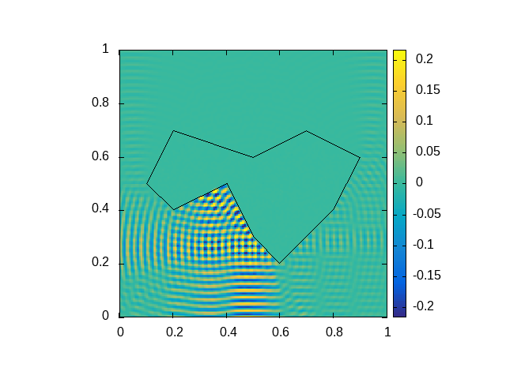

# Example plots

## Square scatterer

The scatterer is set to a unit square with $n_i=3$. The incoming wave is a plane wave $u_{inc}(x)=e^{i k d\cdot x}$ where $d = (\cos{\pi\over 3},\sin{\pi\over 3})$ and $k=40$ (left) resp. $k=40.696424$ (quasi-resonance, right).

  
  

## Hollow box scatterer with a hole

Hollow box scatterer with incoming plane wave from below, $n_i=10$, $k=120.18$ resp. $k=120.40159$ (quasi-resonance):

  
  

At $n_i=100$ and $k=40.1$ resp. $k=40.0425$ (quasi-resonance):

  
  

Note the increase of amplitude of the transmitted wave at quasi-resonance wave numbers $k$. The corresponding amplitude plots for $n_i=100$ are shown below.

  
  

## Analytical solution on circle

The solution of the Helmholtz transmission problem on a circle with the incoming wave $u_{inc}(x)=J_{-2}(k r) e^{-2i\phi}+J_{-1}(k r) e^{-i\phi}+J_0(k r)+J_1(k r) e^{i\phi}+J_2(k r) e^{2i\phi}$, $x=(r\sin\phi,r\cos\phi)$ and $k=40$, coincides with the analytical solution (see [Diego Renner's thesis](https://github.com/DiegoRenner/ThesisDoc), section 2.3).

  

The same incoming wave scattered accros a torn/distorted circle:

  
  

## Incoming wave reflection

In the following examples, the incoming wave is a Herglotz wave function with $k=250$ and the inner refraction index $n_i$ is set to a very large value ($n_i=10^6$) so that the transmitted wave is practically zero.
The left image shows the sum of the scattered and incoming wave, and the right image shows only the scattered wave.

  
  

Another reflection example, in which the Herglotz wave is coming directly from below:

  

