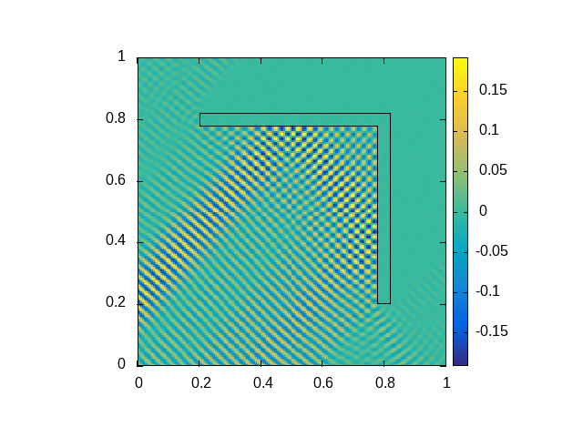

# Example plots

## Incoming wave reflection

In the following examples, the incoming wave is a Herglotz wave function and the inner refraction index $n_i$ is set to a very large value.

This image shows a correctly reflected incoming wave.

This image shows only the scattered wave.

Another reflection example.
